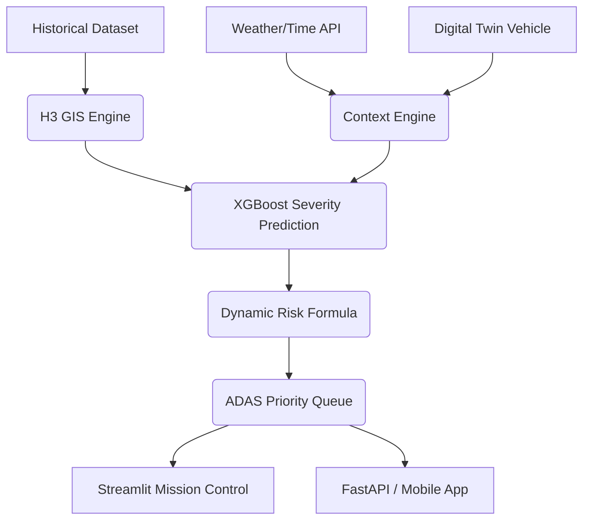

# 🚦 AI-Powered Road Accident Risk Zone Detection & ADAS Simulator


A complete **Intelligent Transportation System (ITS)** that shifts traditional road-risk analysis from static charts to a live **Digital Twin Simulator**. 

This research project integrates Uber's H3 spatial indexing, Machine Learning (XGBoost/RF), Context-Awareness APIs, and an Advanced Driver Assistance System (ADAS) into a single Command Center.

---

## 🌟 Key Features

1. **Risk Intelligence Engine**: Processes 800,000+ historical records, grouping them into `Resolution 8 H3 Hexagons`. Extracts spatial correlations and normalizes the danger into a 0-100 baseline Historical Risk score.
2. **AI Severity Predictor**: Rather than predicting a static formula, XGBoost models use real-time variables (Rain, Night, Curves) to predict independent accident *Severity* (Fatal, Hospitalized, Minor).
3. **Context Awareness API**: Live Modifiers. If it starts raining, the grip and visibility modifiers cascade into the model, converting historically "Safe" hexagons to "Critical" dynamically.
4. **Digital Twin Simulator**: Spawns virtual vehicles with behavioral profiles (`SAFE`, `NORMAL`, `AGGRESSIVE`). Vehicles traverse GPS coordinates utilizing Haversine linear interpolation.
5. **ADAS HMI Engine**: Replicates a Tesla/Mobileye dashboard. Features a 5-Level Priority Queue, Time-To-Enter (TTE) calculations, Voice Assistant (`pyttsx3`), and Driver Safety Scoring.
6. **Mission Control Playback**: SQLite `vehicle_telemetry` logging enables full Mission Replay—scrub a slider to watch a vehicle move and risk zones evolve.

---

## 🏗 Architecture



---

## 🚀 Quick Start Installation

1. **Clone & Setup Environment**
   ```bash
   git clone https://github.com/username/road-risk-ai.git
   cd road-risk-ai
   python -m venv venv
   source venv/bin/activate  # Windows: venv\Scripts\activate
   pip install -r requirements.txt
   ```

2. **Run the Full Pipeline**
   ```bash
   python preprocessing/data_cleaner.py
   python feature_engineering/feature_builder.py
   python ml/trainer.py
   python gis/map_generator.py
   ```

3. **Start the Command Center**
   ```bash
   streamlit run dashboard/app.py
   ```

4. **Start the REST API (Optional)**
   ```bash
   uvicorn api.fastapi_app:app --reload
   ```

---

## 🎥 The "One-Click" Demo Mode
For academic vivas and presentations, the system includes a **Demo Mode**. 
1. Open the **Mission Control Dashboard**.
2. Navigate to **Live Map**.
3. Select a **Demo Scenario** (e.g., `Heavy Rain / Aggressive Driver`).
4. Watch the entire stack immediately execute: Context recalculates, AI predicts, Risk updates, alerts trigger, and Voice Assistant speaks!

---

## 🧠 Explain My Decision (XAI)
Every AI prediction is fully interpretable. Clicking a Critical Zone opens the SHAP Explainer panel, explicitly detailing the feature contributions (e.g., `Rain: +18%`, `Curve: +12%`, `Night: +9%`), proving the AI is not a black box.

---

## 📜 Academic Citation
If you use this repository for your own research, please cite our `CITATION.cff` and `Zenodo` DOI.

```bibtex
@software{road_risk_ai,
  author = {Student Name},
  title = {AI-Powered Road Accident Risk Zone Detection and Real-Time ADAS Engine},
  year = {2026},
  url = {https://github.com/username/road-risk-ai}
}
```
