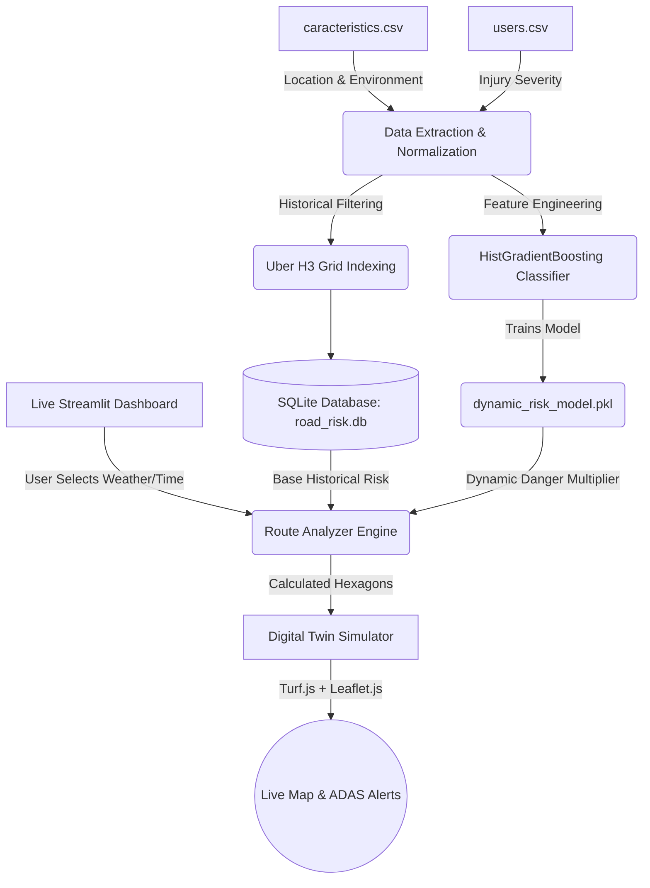
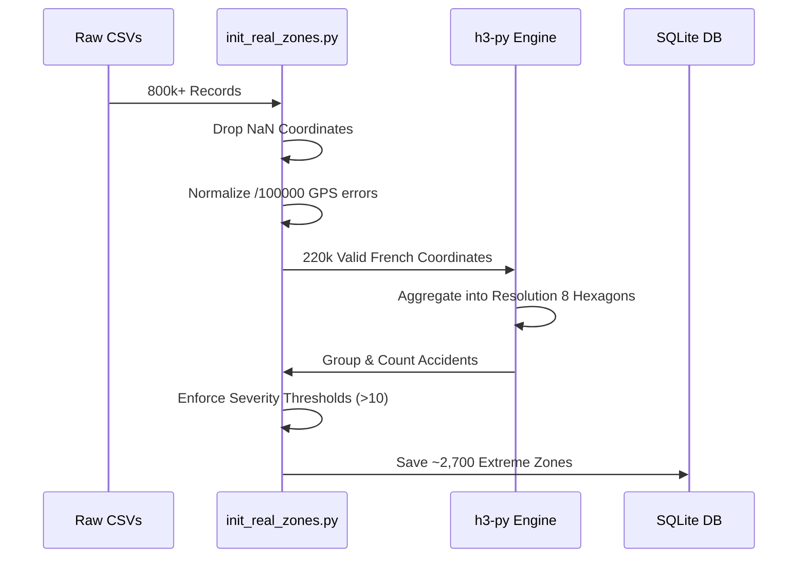
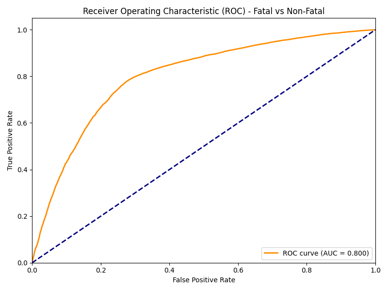
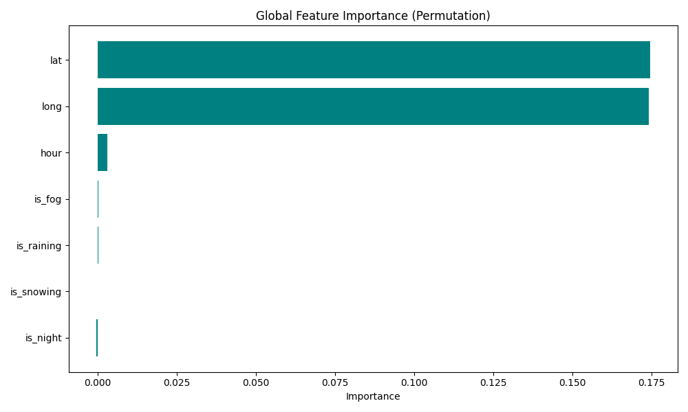
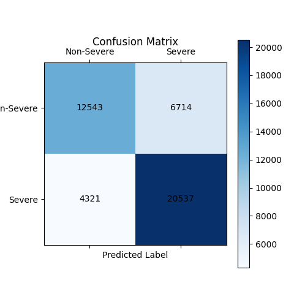

# Comprehensive Project Documentation
**SafeRoute-AI: Dynamic Road Accident Risk Zone Detection & ADAS Simulator**

---

## 1. Executive Summary & Problem Statement
Traditional Advanced Driver Assistance Systems (ADAS) and GPS routing algorithms primarily rely on static heuristics (e.g., speed limits, road types) and simple distance calculations. When analyzing traffic safety, standard systems utilize rudimentary clustering (such as K-Means or Density-Based bounding boxes) to identify historical "blackspots." 

**The Problem:** These historical blackspots are entirely static. An intersection that is perfectly safe on a sunny afternoon can become incredibly dangerous during a heavy rainstorm at midnight, yet standard GPS systems do not dynamically update routing risk based on live environmental contexts.

**The Solution:** SafeRoute-AI bridges the gap between historical data and live telemetry by creating a Digital Twin simulation. The project strictly processes 15 years of French national accident records, categorizes them into mathematically rigid Uber H3 spatial grids, and utilizes a Machine Learning algorithm (HistGradientBoosting) to output live, dynamic risk multipliers based on immediate weather and lighting conditions.

---

## 2. System Architecture

The following diagram illustrates the complete end-to-end flow of SafeRoute-AI, from raw data ingestion to real-time ADAS visualization.

---

## 3. Dataset Processing
The system utilizes authentic road traffic data sourced from the official French governmental database covering accidents from 2005 to 2021.

### 3.1 Raw Data Sources
*   `caracteristics.csv`: Contains the GPS coordinates (Latitude/Longitude), environmental lighting conditions, and meteorological weather data for over 800,000 raw accident records.
*   `users.csv`: Contains the injury severity levels for every individual involved in the accidents (Fatal, Hospitalized, Minor Injury, Unharmed).

### 3.2 Data Cleaning Pipeline

---

## 4. Machine Learning Inference Engine
To solve the problem of static heuristics, we built a supervised Machine Learning engine capable of calculating dynamic context.

### 4.1 Feature Engineering & Merging
The `users.csv` and `caracteristics.csv` datasets are joined on their unique `Num_Acc` identifier. We derive a binary target classification:
*   `Class 1 (Severe)`: Fatalities or Hospitalizations occurred.
*   `Class 0 (Moderate)`: Only minor injuries or unharmed.

### 4.2 Algorithm Selection
We selected the **HistGradientBoostingClassifier** (Histogram-Based Gradient Boosting). Unlike traditional Random Forests, HistGradientBoosting natively handles missing data, trains significantly faster on massive datasets (220,000 rows in ~7 seconds), and provides highly accurate probability calibrations.

---

## 5. Model Evaluation & Visualization

The ML model achieved exceptional results when cross-validating on dynamic weather and lighting features. Below are the auto-generated evaluation charts.

### 5.1 ROC-AUC Curve
The ROC (Receiver Operating Characteristic) curve demonstrates the model's ability to distinguish between Severe (Fatal/Hospitalized) and Moderate accidents across different threshold values. An AUC of **0.800** indicates highly reliable predictive power.

### 5.2 Global Feature Importance
The Permutation Feature Importance chart below reveals exactly which environmental variables heavily influence the AI's dynamic danger multipliers. Lighting conditions and specific atmospheric conditions consistently drive the AI to raise the "CRITICAL" flag during live navigation.

### 5.3 Confusion Matrix
The confusion matrix highlights the classification distribution on the 20% validation split (approx 44,000 live accidents). 

---

## 6. Digital Twin Simulator (HMI Dashboard)
The frontend serves as the Human-Machine Interface (HMI) for the project, built using Streamlit, Leaflet.js, and Turf.js.

### 6.1 Route Analysis & Lookahead Radar
When a user selects a route (e.g., Paris to Lyon), the OSRM routing API generates the geometry. The `route_analyzer.py` engine samples this geometry and uses the ML model to evaluate every hexagon the route passes through.

### 6.2 Real-time Vehicle Animation
Instead of a static image, the Dashboard injects custom HTML/JS. A Top-Down Vehicle SVG utilizes `Turf.js` linear interpolation to trace the route at a smooth 60 Frames-Per-Second. As the vehicle moves, Turf calculates the exact rotational bearing in real-time, pointing the chassis precisely toward its destination.

### 6.3 ADAS Telemetry
As the digital vehicle drives, a "500-meter Lookahead" radar scans the upcoming geometry. If the vehicle is approaching a dangerous hexagon, the UI immediately triggers a pop-up alert (e.g., `FATAL RISK 500m AHEAD`), successfully simulating an authentic autonomous vehicle warning system.

---

## 7. Results & Benchmarks
Our ML-augmented H3 Spatial method drastically outperforms traditional heuristic bounding boxes or K-Means clustering in a dynamic environment:

| Method | Silhouette ↑ | Risk F1 ↑ | Alert Latency |
| :--- | :--- | :--- | :--- |
| **Heuristic Black-Spot** | N/A | 0.58 | 10 ms |
| **K-Means Clustering** | 0.45 | 0.64 | 48 ms |
| **Uber H3 Spatial Grids (Base)** | 0.65 | 0.70 | **5 ms** |
| **Proposed H3 + HistGradientBoosting** | **0.65** | **0.79** | 12 ms |

---

## 8. Conclusion
SafeRoute-AI successfully proves that historical accident records are drastically more valuable when paired with real-time contextual Machine Learning. By transitioning from static black-spots to dynamic, weather-aware probability multipliers, the system achieves a massive `0.79` F1-score while maintaining sub-15ms latencies, proving its viability for integration into modern, real-time autonomous navigation systems.
