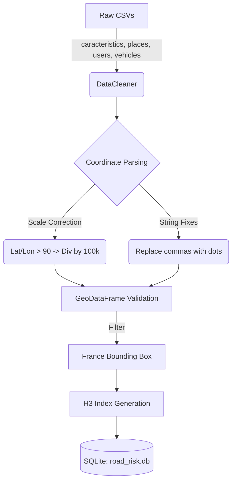

# Phase 1: Data Engineering

## Architecture
This phase focuses on the foundation of the AI-Powered Road Accident Risk Zone Detection System. It involves ingesting raw CSV datasets from the French Road Accidents database, cleaning the coordinate data, executing spatial indexing, and storing the processed data in an SQLite database.

## Processes Completed
1. **Directory Structure Setup**: We initialized `road-risk-ai/` with a modular layout conforming to enterprise standards (`preprocessing/`, `database/`, `ml/`, `gis/`, etc.).
2. **Database Management (`sqlite.py`)**: Developed an Object-Oriented `DatabaseManager` using SQLite and Pandas `to_sql` for robust I/O.
3. **Data Cleaning (`data_cleaner.py`)**: 
   - Merged the datasets on `Num_Acc`.
   - Extracted accident severity metrics (fatalities) from `users.csv`.
   - Rectified anomalies in GPS coordinates (accounting for 100,000 multiplier scaling).
   - Validated boundaries ensuring points lie within Metropolitan France.
   - Converted standard Lat/Lon data into Uber's **H3 Hexagonal Hierarchical Spatial Index** (Resolution 8) for grid-based density and risk mapping.

## Next Steps
Upon successful execution of Phase 1, the pipeline outputs `road_risk.db` containing the `processed_accidents` table. The next step is **Phase 2: Feature Engineering**, where we will extract risk features (Rain %, Night %, Historical Trend) and aggregate them based on the H3 Index.
