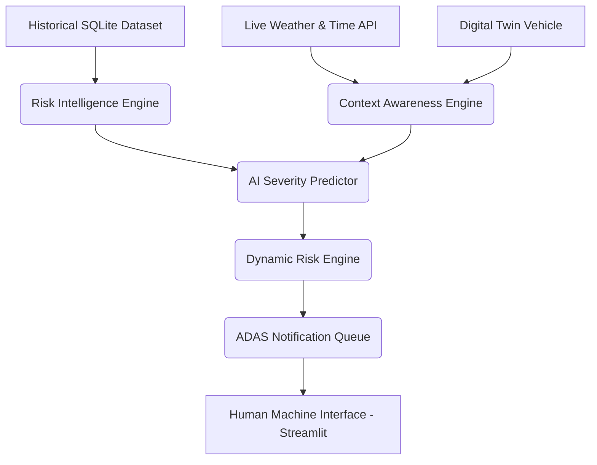
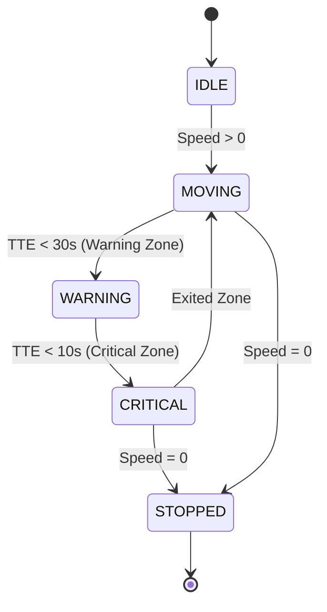
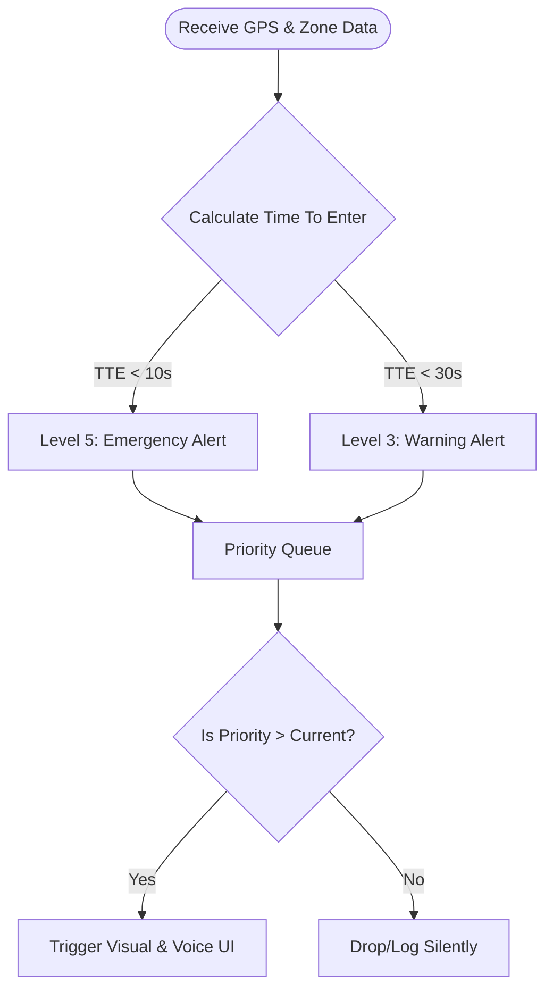

# Phase 9: Advanced Driver Assistance System (ADAS) Engine

## Automotive Industry Architecture
Moving away from a simple "Alert Popup" system, Phase 9 re-architects the Driver Alert mechanism to mimic modern ADAS platforms (like Mobileye or Tesla Autopilot).

The system doesn't trigger blindly based on distance. It calculates the physical **Time To Enter (TTE)** based on the digital twin's current speed and exact distance to the boundary of a critical H3 hexagon.

## Core Modules (`adas/`)
1. **`zone_monitor.py`**: Computes TTE. If a vehicle is doing 120km/h toward a Critical Zone, the TTE shrinks rapidly, triggering alerts much earlier than a vehicle moving at 30km/h.
2. **`alert_engine.py`**: A 5-Level Priority System.
   - 🟢 Level 1 (Information)
   - 🟡 Level 2 (Caution)
   - 🟠 Level 3 (Warning)
   - 🔴 Level 4 (Critical)
   - ⚫ Level 5 (Emergency)
3. **`notification_manager.py`**: Implements a Priority Min-Max Queue (`heapq`). If five alerts trigger simultaneously (e.g., Rain + High Speed + Critical Zone), the queue squashes lower-priority noise and *only* presents the highest priority emergency to the driver.
4. **`driver_scorer.py`**: Dynamically adjusts a Driver Safety Score from 100 based on their responsiveness to alerts and contextual speeding (e.g., speeding in heavy rain deducts more points than speeding on a sunny day).
5. **`recommendation_engine.py`**: Translates AI insights into actionable Human Machine Interface (HMI) commands ("Reduce Speed", "Turn On Fog Lights").
6. **`voice_assistant.py`**: Simulated `pyttsx3` voice prompts to audibly warn the driver without forcing them to look at the screen.

## Streamlit HMI
A dedicated Streamlit page (`6_ADAS_Display.py`) acts as the in-car console, fetching live telemetry and presenting the prioritized, contextualized warnings and AI recommendations.

---

## IEEE Research Paper Assets (Mermaid Diagrams)

### 1. System Architecture (Component Diagram)

### 2. Vehicle State Machine

### 3. ADAS Alert Priority Logic (Activity Diagram)

